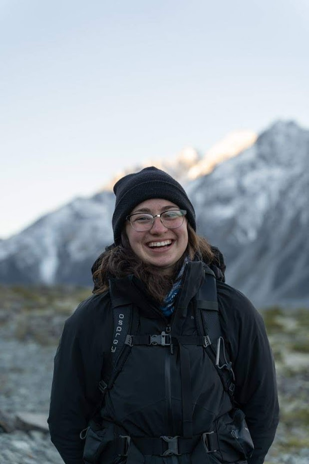

Hi! My name is Sabina. I am a machine learning engineer at Korbit, and an MSc Student in Computer Science at McGill University studing under Professor Jackie Cheung! I am passionate about NLP and a list of ever growing topics in the field of machine learning. I look forward to connecting with you.

Educational History:
- BA&Sc in Cognitive Science (specialization in Computer Science) at McGill University 
- DEC in Health Sciences at Dawson College 

Work History:
- Korbit Technologies Inc. - Machine Learning Intern - September 2021 to now
- Korbit Technologies Inc. - Content Creator - April 2020 to August 2021
- TEAM TA at McGill University - August 2019 to December 2020

Projects/Publications:
- Francois' Paper
- Prometheus AI - May to Sep 2020
    - I worked to model synaptic plasticity in a model of human memory, called the Knowledge Node Network, in the Prometheus AI Lab under Professor Vybihal at McGill University.

Awards:
- Mitacs Accelerate AwardMitacs Accelerate Award - Sep 2021
    - https://www.mitacs.ca/en/programs/acceleratehttps://www.mitacs.ca/en/programs/accelerate
- TECHNATION Career Ready Regional Rising Star Award - Dec 2020
